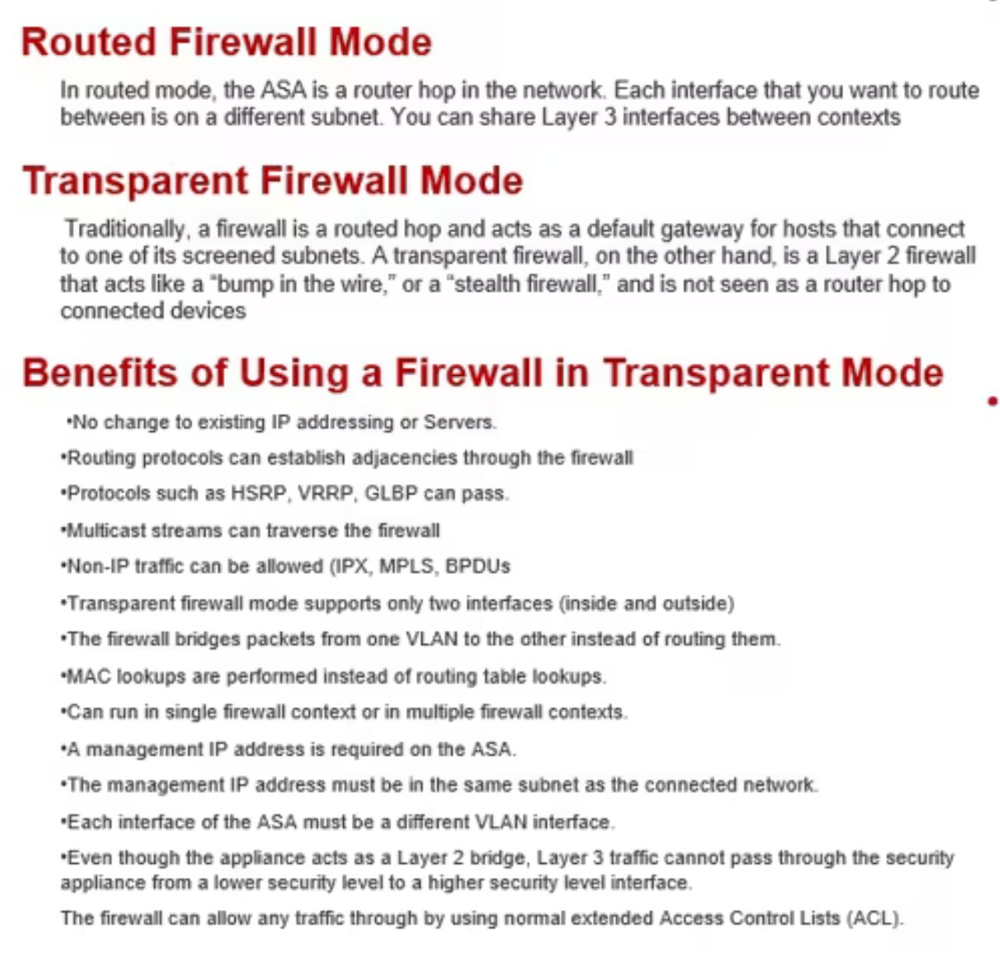
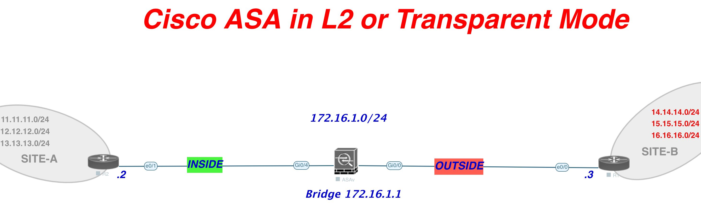

[Open: Pasted image 20260113115039.png](../../../Media/80d18a15dfba18a331a325fc3e79934e_MD5.jpeg)


[Open: Pasted image 20260113115100.png](../../../Media/721b3c0235c02e1334e9e2c5390dc9c7_MD5.jpeg)


# Lab

[Open: Pasted image 20260113115638.png](../../../Media/1fa3f9bd306b85db1cd9a3d37f22db39_MD5.jpeg)


Check what mode the ASA is in

```
show firewall

ciscoasa# show firewall
Firewall mode: Router
ciscoasa# 

# switch to transparent mode

ciscoasa(config)# firewall transparent 

```

Configure ASA Interfaces
```
ciscoasa(config)# int gi0/4
ciscoasa(config-if)# no shut
ciscoasa(config-if)# bridge-group 1
ciscoasa(config-if)# nameif Inside
INFO: Security level for "Inside" set to 100 by default.
ciscoasa(config-if)# 
ciscoasa(config-if)# int gi0/0
ciscoasa(config-if)# bridge-group 1
ciscoasa(config-if)# no shut
ciscoasa(config-if)# nameif Outside
INFO: Security level for "Outside" set to 0 by default.
ciscoasa(config-if)# int bv1
ciscoasa(config-if)# ip address 172.16.1.1 255.255.255.0

```

Create ACL to allow R1 to telnet to R2

```
ip access-list outside permit tcp host 172.16.1.3 host 172.16.1.2 eq telnet
access-group outside in interface Outside
```

Configure OSPF to allow R1/R2 to exchange routes to loopback networks

```
R1


R2
```