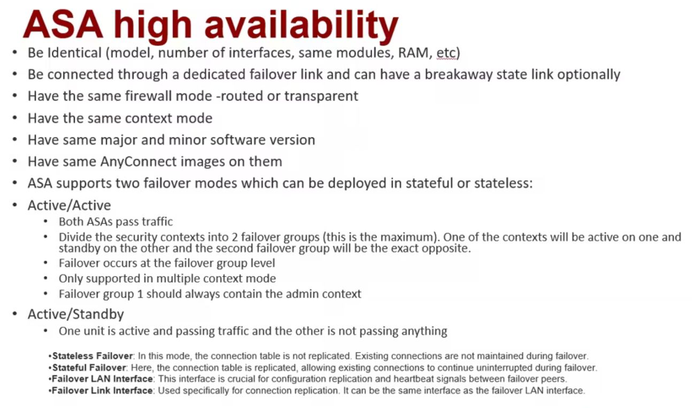
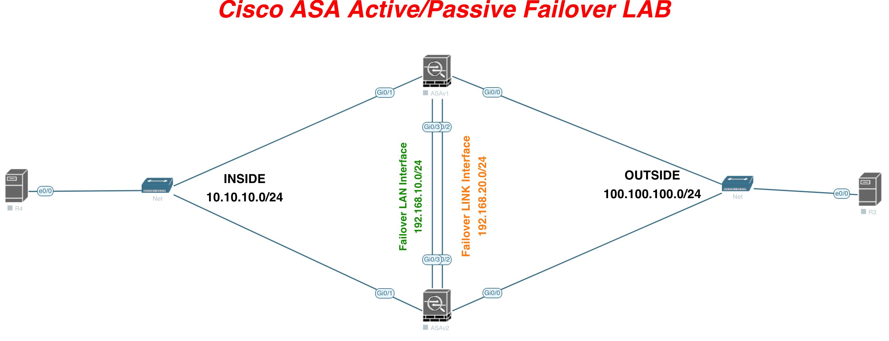

[Open: Pasted image 20260119085514.png](../../../Media/f1f92e294106d61b68c9ad5d0ec54844_MD5.jpeg)


Active/Standby lab. Primary and Secondary, primary is active and passes traffic. 

Configure 2 HA Links. Failover LAN and Failover Link.
# Lab

[Open: Pasted image 20260119085608.png](../../../Media/8eb81951f38d70f71e1e508ac8602ba7_MD5.jpeg)


```
# Active Config

# Configure Failover Intefaces (LAN)
int gi0/2
	no shut
	
failover lan interface FAIL gi0/2
failover interface ip  FAIL 192.168.1.1 255.255.255.0 standby 192.168.1.2
failover lan unit primary 
failover key cisco123
failover

# Standy Config

# Configure Failover Intefaces
int g0/2
	no shut
	
failover lan interface FAIL gi0/2
failover interface ip  FAIL 192.168.1.1 255.255.255.0 standby 192.168.1.2
failover lan unit secondary 
failover key cisco123
failover
```

```
# Active Config

# Configure Failover Intefaces (State)
int gi0/3
	no shut
	
failover link STATE gi0/3
failover interface ip STATE 192.168.20.1 255.255.255.0 standby 192.168.20.2

# State config will replicate to standby due to the previous LAN failover link


```