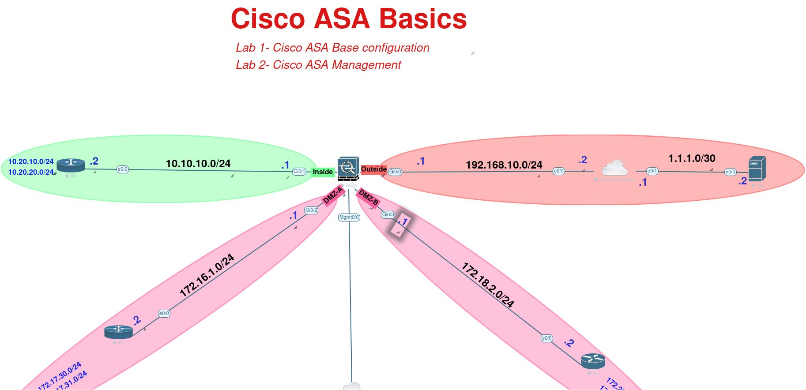

[Open: Pasted image 20250626134500.png](../../../Media/84a61663ff783804d4b228ac132dbe6f_MD5.jpeg)


Get DMZ interfaces to talk to each other:

```
same-security-traffic permit inter-interface
```

---

When ping doesn't work on an ASA - make sure we're inspecting icmp or explicit allowing it via ACL

```
policy-map global_policy
 class inspection_default
  inspect icmp
```

---

If you encounter these types of errors connecting to ASA during the lab

R1#
*Jun 26 18:47:26.960: %SSH-3-NO_MATCH: No matching kex algorithm found: clie
nt diffie-hellman-group-exchange-sha1,diffie-hellman-group14-sha1 server dif
fie-hellman-group14-sha256,kex-strict-s-v00@openssh.com
R1#

Change the key exchange:

```
ssh key-exchange group dh-group14-sha1
```