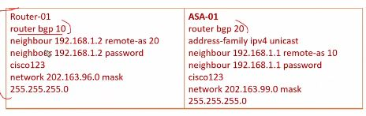
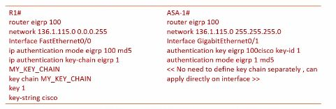

OSPF Configuration and Auth

4 OSPF Auth types supported

0 - Null
1 -  Plain Text
2 - md5
3 - SHA

ASA Features

OSPF auth defined under router ospf process, or directly on interface
OSPF key only defined under interface
If auth defined in both the process and interface, interface takes priority
Can't define passive interface
support of intra-area, inter-area, and external (I, II types) routes
Supports virtual link
ospf lsa flooding
auth ospf packets
asa can be DR, DBR, ABR
Support stub and not-so-stubby areas
Area boundary router type 3 lsa filtering

---

BGP Authentication

ASA - supported on 9.6 and up
Not best practice on a firewall, use a dedicated router for bgp

[Open: Pasted image 20250708221223.png](../../../Media/22d9c86c1db4dce18ef62c94fb748a02_MD5.jpeg)

---

EIGRP Authentication

ASA supported md5
ASA pass supported under interface
Router - use a key chain

[Open: Pasted image 20250708221340.png](../../../Media/43e2f3b4b69f3b1e09a6cbcc278e31c8_MD5.jpeg)

