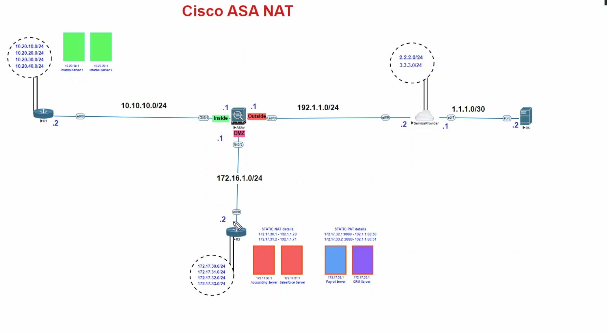

[Open: Pasted image 20260105193545.png](../../../Media/55147e21fda186914e41be4d0980cd73_MD5.jpeg)


R3 Address to telnet to:
172.16.1.2

nat (dmz, outside)

want to telnet to 172.16.1.2 from outside 3.3.3.1

translate 3.3.3.1 -> to a dummy ip 172.16.1.90

new object

```
# object and nat for r3 interface

object network r3
	host 172.16.1.2
	nat(dmz,outside) static 192.1.1.24

# object and nat for outside ip 3.3.3.1 to dummy ip
object network DESTNAT
	host 3.3.3.1
	nat(outside,dmz) static 172.16.1.90
```

allow through access list through outside

```
access-list outside permit tcp any host 172.16.1.2 eq 23
```

