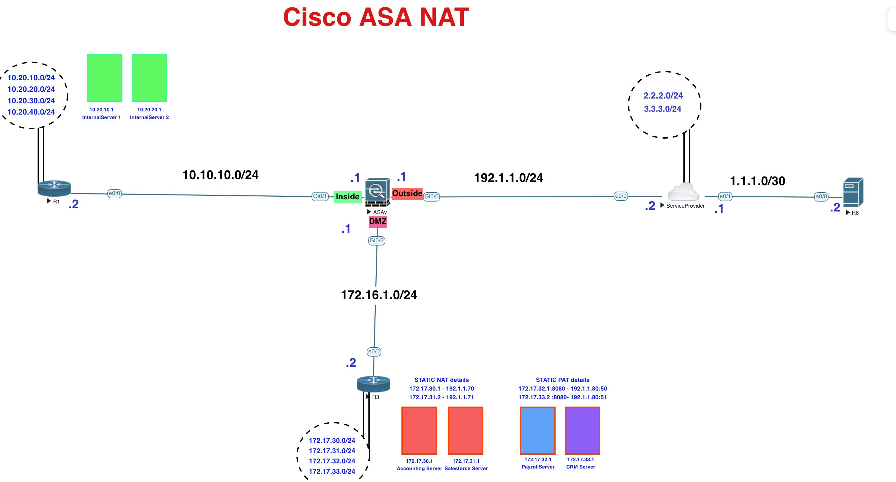

[Open: Pasted image 20260106200903.png](../../../Media/9e4dd8f064cb8c9d758d86be55c40074_MD5.jpeg)


Create new pool of 192.1.1.3 - 192.1.1.20 to allow for inside networks 10.20.10.0/24 and 10.20.20.0/24 to access the internet

```
# create network objects for external pool
object network ISPPOOL
	range 192.1.1.3 192.1.1.20
	
# define internal subnets to by nat'ed
object network INTNET_10.20.10.0
	subnet 10.20.10.0 255.255.255.0
	nat (inside,outside) dynamic ISPPOOL
	
object network INTNET_10.20.20.0
	subnet 10.20.20.0 255.255.255.0
	nat (inside,outside) dynamic ISPPOOL

```

Note: ping was not working through the ASA by default. Needed to enable icmp inspection in the global policy map/class inspection.

